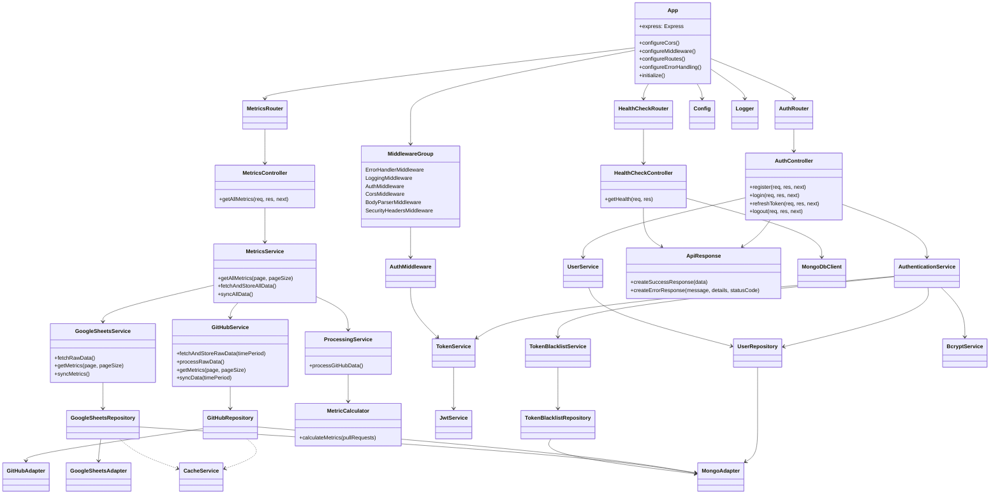
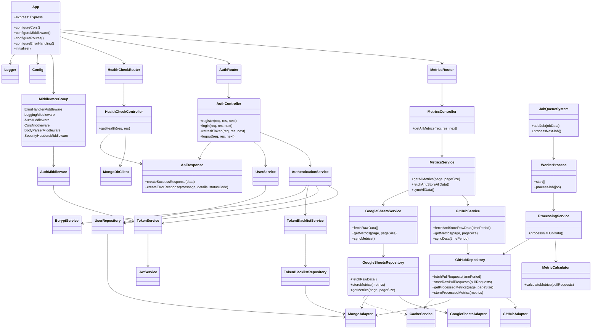

# Target Architecture v3

## Current Architecture (as of Sep 15, 2024)

## Motivation for the new Target Architecture

A reflection on the current state of architecture, and potential improvements.

### Asynchronous Processing

Issue: The current architecture lacks a clear mechanism for asynchronous processing of raw data.
Improvement: Introduce a JobQueueSystem and WorkerProcess to manage asynchronous tasks, particularly for processing GitHub data.

### Separation of Concerns

Issue: ProcessingService is directly connected to MetricsService, which may not be ideal for separation of concerns.
Improvement: Move ProcessingService to be triggered by the WorkerProcess, separating it from the main request flow.

### Data Flow Clarity

Issue: The flow of data from raw storage to processed metrics is not clearly defined.
Improvement: Clearly define the path of data from GitHubRepository through ProcessingService and back to storage as processed metrics.

### Google Sheets Data Handling

Issue: Google Sheets data is treated similarly to GitHub data, but it doesn't require processing.
Improvement: Simplify the Google Sheets data flow, removing unnecessary processing steps.

### Caching Strategy

Issue: The current use of CacheService is not clearly defined across repositories.
Improvement: Implement a consistent caching strategy, particularly for frequently accessed data.

### MetricCalculator Placement

Issue: MetricCalculator is tied directly to GitHubRepository, which might limit its reusability.
Improvement: Consider moving MetricCalculator to the service layer, possibly as part of MetricsService. This would allow it to be used with data from multiple sources, not just GitHub.

### Config and Logger Usage

Issue: While Config and Logger are shown connected to App, their usage across other components isn't clear.
Improvement: Consider showing these as cross-cutting concerns, perhaps by indicating that they can be injected into any component.

### AuthService Responsibilities

Issue: AuthService seems to handle both authentication and user management.
Improvement: Consider splitting this into separate services: AuthService for authentication/authorization and UserService for user management operations.

### Middleware Representation

Issue: Middleware is grouped but its interaction with the application flow isn't clear.
Improvement: Consider showing how middleware integrates into the request processing pipeline.

### Error Handling

Issue: Error handling isn't clearly represented in the architecture.
Improvement: Consider adding a global error handling mechanism or service that works across all layers of the application.

## Data Access Layer

- GitHubRepository:
  - Fetches data from GitHub API
  - Stores raw data in MongoDB
  - Retrieves processed metrics from MongoDB
- GoogleSheetsRepository:
  - Fetches data from Google Sheets API
  - Stores and retrieves data in/from MongoDB (no processing needed)

## Business Logic Layer

- GitHubService:
  - Orchestrates GitHub data fetching and storage
  - Retrieves processed GitHub metrics
- GoogleSheetsService:
  - Orchestrates Google Sheets data fetching and storage
  - Retrieves Google Sheets metrics
- ProcessingService:
  - Processes raw GitHub data
  - Uses MetricCalculator
  - Stores processed metrics in MongoDB
- MetricCalculator:
  - Calculates metrics from raw GitHub data
- MetricsService:
  - Orchestrates overall metrics retrieval process
  - Combines metrics from GitHub and Google Sheets

## Presentation Layer

- MetricsController:
  - Handles API requests for metrics
  - Uses MetricsService to retrieve and return data

## Data Flow

1. GitHubRepository and GoogleSheetsRepository fetch and store raw data
2. Job Queue System creates processing jobs
3. Worker Process picks up jobs and triggers ProcessingService
4. ProcessingService processes GitHub data using MetricCalculator
5. Processed metrics are stored in MongoDB
6. Upon API request, MetricsService retrieves processed metrics via GitHubService and GoogleSheetsService
7. MetricsController returns combined metrics to the client

Here's a high-level description of the new target architecture:

- Clearly defined data flow: Raw data fetching, storage, processing, and retrieval.
- Asynchronous processing mechanism using JobQueueSystem and WorkerProcess.
- Clear separation between GitHub data (which needs processing) and Google Sheets data (which doesn't).
- Consistent use of repositories for data access across all services.
- Improved separation of concerns, with ProcessingService decoupled from MetricsService.
- Retained SSE capabilities for real-time updates.
- Maintained authentication and authorization flow.

## Target Architecture

