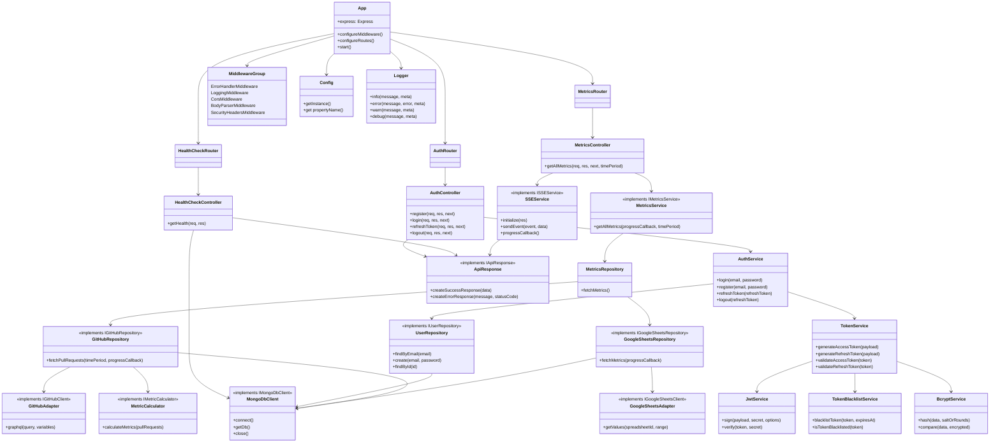
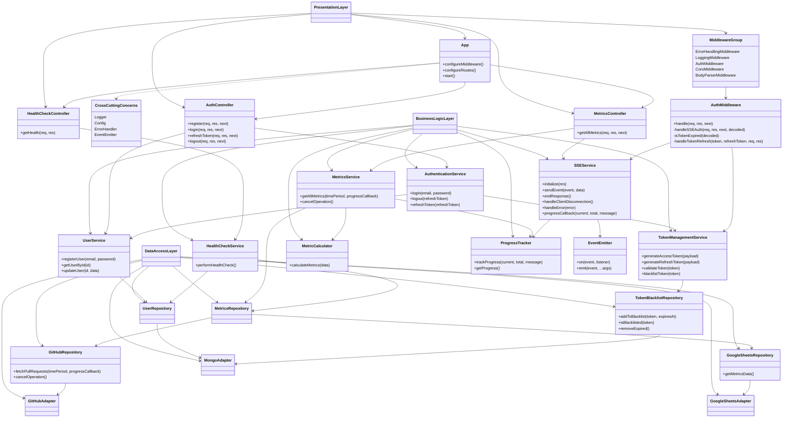

# Target Architecture v3

## Current Architecture (as of Sep 1, 2024)

## Motivation for the new Target Architecture

A reflection on the current state of architecture, and potential improvements.

### Inconsistent Repository Pattern

Issue: GitHubRepository and GoogleSheetsRepository are using adapters (GitHubAdapter and GoogleSheetsAdapter), while UserRepository directly uses MongoDbClient.
Improvement: Consider introducing a MongoAdapter to maintain consistency across repositories. This would provide a uniform interface for database operations and make it easier to switch databases if needed.

### MetricCalculator Placement

Issue: MetricCalculator is tied directly to GitHubRepository, which might limit its reusability.
Improvement: Consider moving MetricCalculator to the service layer, possibly as part of MetricsService. This would allow it to be used with data from multiple sources, not just GitHub.

### Direct Database Access in HealthCheckController

Issue: HealthCheckController directly uses MongoDbClient, bypassing the repository layer.
Improvement: Introduce a HealthCheckService that encapsulates the health check logic, including database checks. This maintains separation of concerns and consistency with other controllers.

### SSEService Coupling

Issue: SSEService is tightly coupled with MetricsController and ApiResponse.
Improvement: Consider making SSEService more generic, possibly moving it to a middleware or utility layer. This would allow it to be used by other controllers if needed.

### Config and Logger Usage

Issue: While Config and Logger are shown connected to App, their usage across other components isn't clear.
Improvement: Consider showing these as cross-cutting concerns, perhaps by indicating that they can be injected into any component.

### AuthService Responsibilities

Issue: AuthService seems to handle both authentication and user management.
Improvement: Consider splitting this into separate services: AuthService for authentication/authorization and UserService for user management operations.

### Lack of Clear Layer Separation

Issue: The diagram doesn't clearly show the separation between different layers (e.g., presentation, business logic, data access).
Improvement: Reorganize the diagram to clearly show these layers, which would make the architecture easier to understand and maintain.

### TokenService and TokenBlacklistService Separation

Issue: These two services are closely related but separated.
Improvement: Consider merging them into a single TokenManagementService to encapsulate all token-related operations.

### Middleware Representation

Issue: Middleware is grouped but its interaction with the application flow isn't clear.
Improvement: Consider showing how middleware integrates into the request processing pipeline.

### Error Handling

Issue: Error handling isn't clearly represented in the architecture.
Improvement: Consider adding a global error handling mechanism or service that works across all layers of the application.

Here's a high-level description of an improved target architecture:

- Clearly defined layers: Presentation (Controllers), Business Logic (Services), Data Access (Repositories with consistent Adapter usage).
  Cross-cutting concerns (Logging, Configuration) available to all layers.
- Consistent pattern usage across similar components (e.g., all repositories using adapters).
- Clear separation of responsibilities (e.g., separate Authentication and User Management services).
- Generic, reusable components (e.g., a more flexible SSEService, generalized MetricCalculator).
- Clear error handling and middleware integration.

