# Target Architecture v4

## Current Architecture (as of Sep 21, 2024)

```mermaid
classDiagram
    App --> MetricsRouter
    App --> AuthRouter
    App --> HealthCheckRouter
    App --> MiddlewareGroup

    MetricsRouter --> MetricsController
    AuthRouter --> AuthController
    HealthCheckRouter --> HealthCheckController

    MetricsController --> MetricsService
    AuthController --> AuthenticationService
    AuthController --> UserService
    AuthController --> ApiResponse
    HealthCheckController --> MongoDbClient
    HealthCheckController --> ApiResponse

    MetricsService --> GitHubService
    MetricsService --> GoogleSheetsService
    MetricsService --> MetricCalculator
    MetricsService --> ProgressTracker
    GitHubService --> GitHubRepository
    GoogleSheetsService --> GoogleSheetsRepository

    AuthenticationService --> TokenService
    AuthenticationService --> UserRepository
    AuthenticationService --> TokenBlacklistService
    AuthenticationService --> BcryptService
    UserService --> UserRepository

    TokenService --> JwtService
    TokenBlacklistService --> MongoAdapter

    GitHubRepository --> GitHubAdapter
    GoogleSheetsRepository --> GoogleSheetsAdapter

    UserRepository --> MongoAdapter
    GitHubRepository --> MongoAdapter
    GoogleSheetsRepository --> MongoAdapter

    GitHubRepository ..> CacheService
    GoogleSheetsRepository ..> CacheService

    App --> Config
    App --> Logger

    MiddlewareGroup --> AuthMiddleware
    AuthMiddleware --> TokenService
    AuthMiddleware --> TokenBlacklistService
    AuthMiddleware --> AuthenticationService

    class App {
        +express: Express
        +configureCors()
        +configureMiddleware()
        +configureRoutes()
        +configureErrorHandling()
        +initialize()
    }

    class MiddlewareGroup {
        ErrorHandler
        AuthMiddleware
        CorsMiddleware
        BodyParserMiddleware
    }

    class MetricsService {
        <<implements IMetricsService>>
        +getAllMetrics(page, pageSize)
        +syncAllData()
        +fetchAndStoreAllData()
    }

    class GitHubService {
        <<implements IGitHubService>>
        +fetchAndStoreRawData(timePeriod)
        +getProcessedMetrics(page, pageSize)
        +syncData(timePeriod)
        +getTotalPRCount()
    }

    class GoogleSheetsService {
        <<implements IGoogleSheetsService>>
        +fetchRawData()
        +fetchAndStoreMetrics()
        +getMetrics(page, pageSize)
        +syncMetrics()
        +getTotalMetricsCount()
    }

    class GitHubRepository {
        <<implements IGitHubRepository>>
        +fetchPullRequests(timePeriod)
        +storeRawPullRequests(pullRequests)
        +getRawPullRequests(page, pageSize)
        +storeProcessedMetrics(metrics)
        +getProcessedMetrics(page, pageSize)
        +getTotalPRCount()
        +syncPullRequests(timePeriod)
        +markPullRequestsAsProcessed(ids)
    }

    class GoogleSheetsRepository {
        <<implements IGoogleSheetsRepository>>
        +fetchRawData()
        +storeMetrics(metrics)
        +getMetrics(page, pageSize)
        +getTotalMetricsCount()
        +updateMetrics(metrics)
    }

    class MetricCalculator {
        <<implements IMetricCalculator>>
        +calculateMetrics(data)
    }

    class ProgressTracker {
        +trackProgress(current, total, message)
        +setReportInterval(interval)
    }

    class ApiResponse {
        <<implements IApiResponse>>
        +createSuccessResponse(data)
        +createErrorResponse(message, details, statusCode)
    }

    class MetricsController {
        +getAllMetrics(req, res, next)
        +syncMetrics(req, res, next)
    }

    class AuthController {
        +login(req, res, next)
        +register(req, res, next)
        +refreshToken(req, res, next)
        +logout(req, res, next)
    }

    class AuthenticationService {
        +login(email, password, shortLived)
        +refreshToken(refreshToken)
        +logout(refreshToken)
    }

    class UserService {
        +registerUser(email, password)
        +getUserById(id)
        +updateUserProfile(id, data)
    }

    class HealthCheckController {
        +getHealth(req, res)
    }

    class TokenService {
        +generateAccessToken(payload, expiresIn)
        +generateRefreshToken(payload)
        +validateAccessToken(token)
        +validateRefreshToken(token)
        +decodeToken(token)
    }

    class TokenBlacklistService {
        +blacklistToken(token, expiresAt)
        +isTokenBlacklisted(token)
        +revokeAllUserTokens(userId)
    }

    class UserRepository {
        <<implements IUserRepository>>
        +findByEmail(email)
        +findById(id)
        +create(email, password)
        +updatePassword(id, newPassword)
    }

    class JwtService {
        +sign(payload, secret, options)
        +verify(token, secret)
        +decode(token)
    }

    class BcryptService {
        +hash(data, saltOrRounds)
        +compare(data, encrypted)
    }

    class GitHubAdapter {
        <<implements IGitHubClient>>
        +graphql(query, variables)
    }

    class GoogleSheetsAdapter {
        <<implements IGoogleSheetsClient>>
        +getValues(spreadsheetId, range)
    }

    class MongoAdapter {
        +getCollection(name)
        +getDb()
    }

    class Logger {
        +info(message, meta)
        +error(message, error, meta)
        +warn(message, meta)
        +debug(message, meta)
    }

    class Config {
        +getInstance()
        +get propertyName()
    }

    class MongoDbClient {
        <<implements IMongoDbClient>>
        +connect()
        +getDb()
        +close()
    }

    class CacheService {
        +get(key)
        +set(key, value, ttl)
        +delete(key)
        +clear()
    }

    class JobQueueService {
        <<implements IJobQueueService>>
        +initialize()
        +scheduleJob(jobName, data, options)
        +defineJob(jobName, handler)
        +gracefulShutdown()
    }
```

## Motivation for the Revised Target Architecture

### Enhanced Job Queue System

We're evolving our existing JobQueueService into an EnhancedJobQueueService. This service will incorporate more advanced features like job prioritization, status tracking, and cancellation capabilities.
Rationale: This approach builds upon our existing implementation while adding the desired functionality, reducing the need for a complete overhaul.

### Worker Process Implementation

We'll implement a WorkerProcess to handle the execution of jobs from the EnhancedJobQueueService, particularly focusing on processing GitHub data.
Rationale: This separation of concerns will improve scalability and allow for more efficient handling of time-consuming tasks.

### Processing Service Integration

We're introducing a ProcessingService, which will be triggered by the WorkerProcess instead of being directly connected to the MetricsService. The ProcessingService will use the MetricCalculator to process raw GitHub data.
Rationale: This change improves the separation of concerns and allows for better asynchronous processing of data.

### MetricCalculator Placement

The MetricCalculator is moved from MetricsService to ProcessingService. This allows for more focused and efficient metric calculation during the data processing phase.
Rationale: This placement aligns better with the asynchronous processing flow and separates calculation logic from data retrieval.

### Health Check Service

We've added a dedicated HealthCheckService to handle health check logic, separating it from the controller.
Rationale: This follows the pattern established with other services and improves the separation of concerns.

### Token Management Consolidation

We've merged the TokenService and TokenBlacklistService into a single TokenManagementService.
Rationale: This consolidation simplifies token-related operations and reduces the number of services, improving maintainability.

### Consistent Caching Strategy

We've explicitly shown CacheService being used by GitHubRepository, GoogleSheetsService, and GoogleSheetsRepository.
Rationale: This emphasizes the importance of a consistent caching approach across the application.

### Security Enhancements

We've added RateLimitMiddleware and SecurityHeadersMiddleware to the MiddlewareGroup to explicitly include rate limiting and security headers in our architecture.
Rationale: These additions improve the security posture of our application by preventing potential abuse and implementing best practices for web security.

### Progress Tracking

We've retained the ProgressTracker and connected it to MetricsService to maintain the ability to track long-running operations.
Rationale: This ensures we can still provide progress updates for time-consuming tasks, improving user experience.

### Consistent API Response Handling

We've connected ApiResponse to all controllers to ensure consistent response formatting across the application.
Rationale: This promotes a uniform API response structure, improving the client-side experience and making the API more predictable.

## Data Access Layer

GitHubRepository:

- Fetches data from GitHub API using GitHubAdapter
- Stores raw data in MongoDB using MongoAdapter
  = Retrieves processed metrics from MongoDB
  = Uses CacheService for optimizing data access

GoogleSheetsRepository:

- Fetches data from Google Sheets API using GoogleSheetsAdapter
- Stores and retrieves data in/from MongoDB using MongoAdapter
- Uses CacheService for optimizing data access

## Business Logic Layer

GitHubService:

- Orchestrates GitHub data fetching and storage
- Retrieves processed GitHub metrics

GoogleSheetsService:

- Orchestrates Google Sheets data fetching and storage
- Retrieves Google Sheets metrics

ProcessingService:

- Processes raw GitHub data
- Uses MetricCalculator
- Stores processed metrics in MongoDB via GitHubRepository

MetricCalculator:

- Calculates metrics from raw GitHub data

MetricsService:

- Orchestrates overall metrics retrieval process
- Combines metrics from GitHub and Google Sheets
- Uses ProgressTracker for long-running operations

EnhancedJobQueueService:

- Manages job scheduling, prioritization, and status tracking

WorkerProcess:

- Executes jobs from EnhancedJobQueueService
- Triggers ProcessingService for data processing tasks

## Presentation Layer

MetricsController:

- Handles API requests for metrics
- Uses MetricsService to retrieve and return data

AuthController:

- Manages user authentication and registration

HealthCheckController:

- Handles health check requests using HealthCheckService

All controllers use ApiResponse for consistent response formatting.

### Middleware

- AuthMiddleware: Handles request authentication
- RateLimitMiddleware: Applies rate limiting to prevent abuse
- SecurityHeadersMiddleware: Sets security-related HTTP headers
- ErrorHandlerMiddleware: Provides global error handling
- LoggingMiddleware: Logs incoming requests and responses
- CorsMiddleware: Handles Cross-Origin Resource Sharing
- BodyParserMiddleware: Parses incoming request bodies

## Data Flow

- GitHubRepository and GoogleSheetsRepository fetch and store raw data
- EnhancedJobQueueService creates processing jobs
- WorkerProcess picks up jobs and triggers ProcessingService
- ProcessingService processes GitHub data using MetricCalculator
- Processed metrics are stored in MongoDB via GitHubRepository
- Upon API request, MetricsService retrieves processed metrics via GitHubService and GoogleSheetsService
- MetricsController returns combined metrics to the client using ApiResponse

## Target Architecture

```mermaid
classDiagram
    App --> MetricsRouter
    App --> AuthRouter
    App --> HealthCheckRouter
    App --> MiddlewareGroup

    MetricsRouter --> MetricsController
    AuthRouter --> AuthController
    HealthCheckRouter --> HealthCheckController

    MetricsController --> MetricsService
    MetricsController --> ApiResponse
    AuthController --> AuthenticationService
    AuthController --> UserService
    AuthController --> ApiResponse
    HealthCheckController --> HealthCheckService
    HealthCheckController --> ApiResponse
    HealthCheckService --> MongoDbClient

    MetricsService --> GitHubService
    MetricsService --> GoogleSheetsService
    MetricsService --> ProgressTracker

    GitHubService --> GitHubRepository
    GoogleSheetsService --> GoogleSheetsRepository

    GitHubRepository --> GitHubAdapter
    GoogleSheetsRepository --> GoogleSheetsAdapter

    EnhancedJobQueueService --> WorkerProcess
    WorkerProcess --> ProcessingService
    ProcessingService --> MetricCalculator
    ProcessingService --> GitHubRepository

    AuthenticationService --> TokenManagementService
    AuthenticationService --> UserRepository
    AuthenticationService --> BcryptService
    UserService --> UserRepository

    TokenManagementService --> JwtService

    UserRepository --> MongoAdapter
    GitHubRepository --> MongoAdapter
    GoogleSheetsRepository --> MongoAdapter

    GitHubRepository ..> CacheService
    GoogleSheetsService ..> CacheService
    GoogleSheetsRepository ..> CacheService

    App --> Config
    App --> Logger

    MiddlewareGroup --> AuthMiddleware
    MiddlewareGroup --> RateLimitMiddleware
    MiddlewareGroup --> SecurityHeadersMiddleware
    AuthMiddleware --> TokenManagementService

    class App {
        +express: Express
        +configureCors()
        +configureMiddleware()
        +configureRoutes()
        +configureErrorHandling()
        +initialize()
    }

    class MiddlewareGroup {
        ErrorHandlerMiddleware
        LoggingMiddleware
        AuthMiddleware
        CorsMiddleware
        BodyParserMiddleware
        SecurityHeadersMiddleware
        RateLimitMiddleware
    }

    class MetricsService {
        +getAllMetrics(page, pageSize)
        +fetchAndStoreAllData()
        +syncAllData()
    }

    class GitHubService {
        +fetchAndStoreRawData(timePeriod)
        +getMetrics(page, pageSize)
        +syncData(timePeriod)
    }

    class GoogleSheetsService {
        +fetchRawData()
        +getMetrics(page, pageSize)
        +syncMetrics()
    }

    class ProcessingService {
        +processGitHubData()
    }

    class EnhancedJobQueueService {
        +scheduleJob(jobData)
        +processNextJob()
        +getJobStatus(jobId)
        +cancelJob(jobId)
    }

    class WorkerProcess {
        +start()
        +processJob(job)
    }

    class MetricCalculator {
        +calculateMetrics(pullRequests)
    }

    class ProgressTracker {
        +trackProgress(current, total, message)
        +setReportInterval(interval)
    }

    class ApiResponse {
        +createSuccessResponse(data)
        +createErrorResponse(message, details, statusCode)
    }

    class MetricsController {
        +getMetrics(req, res, next)
        +syncMetrics(req, res, next)
    }

    class AuthController {
        +register(req, res, next)
        +login(req, res, next)
        +refreshToken(req, res, next)
        +logout(req, res, next)
    }

    class HealthCheckController {
        +getHealth(req, res)
    }

    class HealthCheckService {
        +performHealthCheck()
    }

    class GitHubRepository {
        +fetchPullRequests(timePeriod)
        +storeRawPullRequests(pullRequests)
        +getProcessedMetrics(page, pageSize)
        +storeProcessedMetrics(metrics)
    }

    class GoogleSheetsRepository {
        +fetchRawData()
        +storeMetrics(metrics)
        +getMetrics(page, pageSize)
    }

    class TokenManagementService {
        +generateAccessToken(payload)
        +generateRefreshToken(payload)
        +validateToken(token)
        +blacklistToken(token)
        +isTokenBlacklisted(token)
    }

    class RateLimitMiddleware {
        +applyRateLimit(req, res, next)
    }

    class SecurityHeadersMiddleware {
        +applySecurityHeaders(req, res, next)
    }
```

