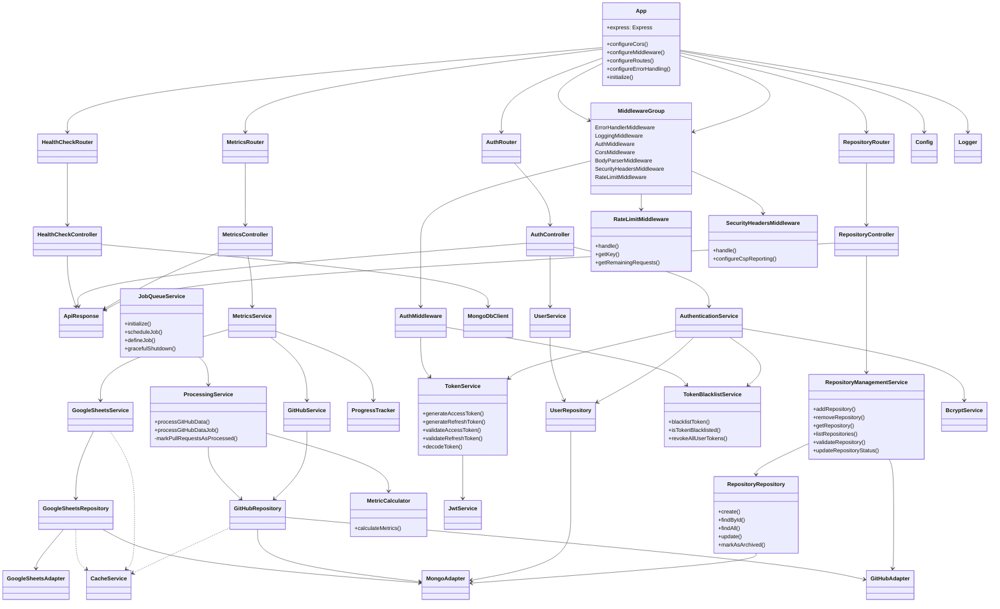

# Target Architecture v5 (January 2025)

## Motivation for Changes Since v4

### Job Queue System

The current JobQueueService implementation remains sufficient for our data processing needs. We've opted not to implement advanced features like job prioritization and status tracking, as our current job volume and complexity don't warrant this additional complexity.

### Processing Service Integration

The ProcessingService is being enhanced to improve GitHub data processing. Key changes:

- Moving MetricCalculator under ProcessingService control
- Implementing batch processing with pagination
- Separating job scheduling from processing logic
- Adding robust error handling and logging

### Health Check Implementation

The health check logic remains in HealthCheckController rather than moving to a separate service. This decision reflects the simplicity of our health check requirements and follows the principle of not adding architectural complexity without clear benefits.

### Token Management

TokenService and TokenBlacklistService remain separate services rather than consolidating into a single TokenManagementService. This maintains clear separation of concerns between token generation/validation and token blacklisting.

## Data Flow

1. Data Ingestion:

   - GitHubRepository and GoogleSheetsRepository fetch raw data
   - Raw data stored in MongoDB via repositories

2. Processing:

   - JobQueueService creates processing jobs
   - ProcessingService processes GitHub data using MetricCalculator
   - Processed metrics stored in MongoDB via GitHubRepository

3. API Requests:

   - MetricsService retrieves processed metrics via GitHubService and GoogleSheetsService
   - Controllers return data using consistent ApiResponse formatting

4. Authentication:
   - AuthController handles auth requests
   - TokenService generates/validates tokens
   - TokenBlacklistService manages revoked tokens

## Repository Management

### Current State

- Environment variables store single repository credentials
- GitHubService uses hardcoded repository access
- No support for multiple repositories

### Target State

- Store repository metadata and credentials in database
- Support multiple GitHub repositories
- Manage repository access and validation
- Control repository sync settings

### Components

- RepositoryRepository: Manages repository metadata storage
- RepositoryManagementService: Handles repository operations
- RepositoryController: Exposes repository management API
- Repository Model: Stores metadata, credentials, and settings

## Updated Class Diagram

## Component Responsibilities

### RepositoryManagementService

- Manages GitHub repository metadata and credentials
- Validates repository access and settings
- Handles repository lifecycle (add, remove, archive)
- Controls repository sync settings
- Ensures secure credential storage

### RepositoryRepository

- Manages database operations for repository metadata
- Implements filtering and pagination for repository listing
- Handles repository status updates
- Manages repository settings storage

### RepositoryController

- Exposes REST API for repository management
- Handles input validation for repository operations
- Implements rate limiting and access control
- Returns standardized API responses

### ProcessingService

- Processes raw GitHub data in batches
- Uses MetricCalculator for metrics computation
- Interfaces with JobQueueService for async processing
- Handles error scenarios and provides detailed logging

### JobQueueService

- Schedules and manages background jobs
- Provides basic job execution capabilities
- Handles graceful shutdown

### TokenService

- Generates access and refresh tokens
- Validates tokens
- Manages token expiration

### TokenBlacklistService

- Manages revoked tokens
- Checks token validity against blacklist
- Handles token revocation

## Implementation Notes

1. All services should implement comprehensive error handling using AppError
2. Services should use the Logger for consistent logging
3. Use CacheService where appropriate for performance optimization
4. Implement proper input validation at controller level
5. Follow established patterns for dependency injection
