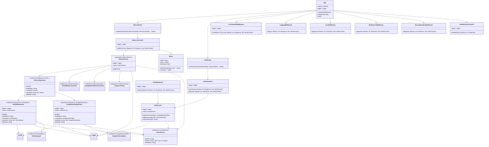

```mermaid
classDiagram
    MetricsController --> MetricsService
    MetricsService --> MetricsRepository
    MetricsRepository --> GitHubRepository
    MetricsRepository --> GoogleSheetsRepository
    MetricsService --> GitHubMetricCalculator
    MetricsService --> GoogleSheetsMetricCalculator
    MetricsService --> ProgressTracker
    MetricsService --> Logger
    MetricsService --> CacheService
    GitHubRepository --> Config
    GitHubRepository --> Logger
    GitHubRepository --> CacheService
    GoogleSheetsRepository --> Config
    GoogleSheetsRepository --> Logger
    GoogleSheetsRepository --> CacheService
    MetricsController --> Metric
    MetricsRouter --> MetricsController
    App --> MetricsRouter
    App --> AuthRouter
    App --> ErrorHandlerMiddleware
    App --> LoggingMiddleware
    App --> CorsMiddleware
    App --> BodyParserMiddleware
    App --> SecurityHeadersMiddleware
    App --> HealthCheckController
    AuthController --> AuthService
    AuthService --> Logger
    AuthService --> CacheService
    AuthRouter --> AuthController
    AuthMiddleware --> AuthService
    GitHubRepository --> GitHubAdapter
    GoogleSheetsRepository --> GoogleSheetsAdapter

    class GitHubAdapter {
        <<implements IGitHubClient>>
    }

    class GoogleSheetsAdapter {
        <<implements IGoogleSheetsClient>>
    }

    class MetricsService {
        <<implements IMetricsService>>
        +getMetrics()
        +logger: Logger
        +cache: CacheService
    }
    class MetricsRepository {
        <<implements IRepository~Metric~>>
        +findAll()
        +findById(id: string)
        +create(item: Metric)
        +update(id: string, item: Metric)
        +delete(id: string)
    }
    class GitHubRepository {
        <<implements IRepository~GitHubData~>>
        +findAll()
        +findById(id: string)
        +create(item: GitHubData)
        +update(id: string, item: GitHubData)
        +delete(id: string)
        +logger: Logger
        +cache: CacheService
    }
    class GoogleSheetsRepository {
        <<implements IRepository~GoogleSheetsData~>>
        +findAll()
        +findById(id: string)
        +create(item: GoogleSheetsData)
        +update(id: string, item: GoogleSheetsData)
        +delete(id: string)
        +logger: Logger
        +cache: CacheService
    }
    class GitHubMetricCalculator {
        <<implements IMetricCalculator>>
    }
    class GoogleSheetsMetricCalculator {
        <<implements IMetricCalculator>>
    }
    class ProgressTracker {
        <<implements IProgressTracker>>
    }
    class CacheService {
        <<implements ICacheService>>
        +get(key: string)
        +set(key: string, value: any, ttl: number)
        +delete(key: string)
    }
    class Metric {
        +name: string
        +value: number
        +timestamp: Date
        +fromRawData(data: any): Metric
        +toJSON(): object
    }
    class MetricsController {
        +getMetrics(req: Request, res: Response, next: NextFunction)
        +logger: Logger
    }
    class MetricsRouter {
        +createMetricsRouter(metricsController: MetricsController): Router
    }
    class App {
        +express: Express
        +configureMiddleware()
        +configureRoutes()
        +start()
        +logger: Logger
    }
    class ErrorHandlerMiddleware {
        +handle(error: Error, req: Request, res: Response, next: NextFunction)
        +logger: Logger
    }
    class LoggingMiddleware {
        +log(req: Request, res: Response, next: NextFunction)
    }
    class CorsMiddleware {
        +apply(req: Request, res: Response, next: NextFunction)
    }
    class BodyParserMiddleware {
        +apply(req: Request, res: Response, next: NextFunction)
    }
    class SecurityHeadersMiddleware {
        +apply(req: Request, res: Response, next: NextFunction)
    }
    class HealthCheckController {
        +getHealth(req: Request, res: Response)
        +logger: Logger
    }
    class AuthController {
        +register(req: Request, res: Response, next: NextFunction)
        +login(req: Request, res: Response, next: NextFunction)
        +logger: Logger
    }
    class AuthService {
        +registerUser(userData: UserRegistrationData)
        +loginUser(credentials: UserCredentials)
        +verifyToken(token: string)
        +logger: Logger
        +cache: CacheService
    }
    class AuthRouter {
        +createAuthRouter(authController: AuthController): Router
    }
    class AuthMiddleware {
        +authenticate(req: Request, res: Response, next: NextFunction)
        +logger: Logger
    }
```
