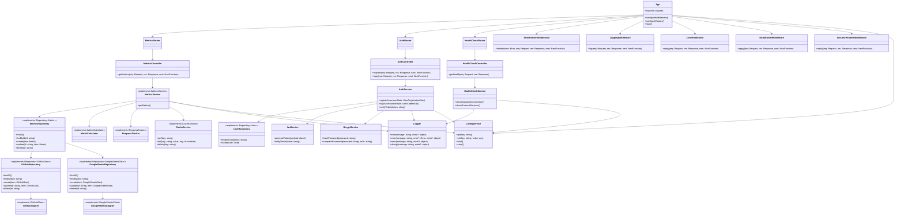

Target Architecture v2

```mermaid

classDiagram
App --> MetricsRouter
App --> AuthRouter
App --> HealthCheckRouter
App --> ErrorHandlerMiddleware
App --> LoggingMiddleware
App --> CorsMiddleware
App --> BodyParserMiddleware
App --> SecurityHeadersMiddleware

    MetricsRouter --> MetricsController
    AuthRouter --> AuthController
    HealthCheckRouter --> HealthCheckController

    MetricsController --> MetricsService
    AuthController --> AuthService
    HealthCheckController --> HealthCheckService

    MetricsService --> MetricsRepository
    MetricsRepository --> GitHubRepository
    MetricsRepository --> GoogleSheetsRepository
    MetricsService --> MetricCalculator
    MetricsService --> ProgressTracker
    MetricsService --> CacheService

    AuthService --> UserRepository
    AuthService --> JwtService
    AuthService --> BcryptService

    GitHubRepository --> GitHubAdapter
    GoogleSheetsRepository --> GoogleSheetsAdapter

    class App {
        +express: Express
        +configureMiddleware()
        +configureRoutes()
        +start()
    }

    class MetricsService {
        <<implements IMetricsService>>
        +getMetrics()
    }

    class MetricsRepository {
        <<implements IRepository~Metric~>>
        +findAll()
        +findById(id: string)
        +create(item: Metric)
        +update(id: string, item: Metric)
        +delete(id: string)
    }

    class GitHubRepository {
        <<implements IRepository~GitHubData~>>
        +findAll()
        +findById(id: string)
        +create(item: GitHubData)
        +update(id: string, item: GitHubData)
        +delete(id: string)
    }

    class GoogleSheetsRepository {
        <<implements IRepository~GoogleSheetsData~>>
        +findAll()
        +findById(id: string)
        +create(item: GoogleSheetsData)
        +update(id: string, item: GoogleSheetsData)
        +delete(id: string)
    }

    class MetricCalculator {
        <<implements IMetricCalculator>>
    }

    class ProgressTracker {
        <<implements IProgressTracker>>
    }

    class CacheService {
        <<implements ICacheService>>
        +get(key: string)
        +set(key: string, value: any, ttl: number)
        +delete(key: string)
    }

    class MetricsController {
        +getMetrics(req: Request, res: Response, next: NextFunction)
    }

    class AuthController {
        +register(req: Request, res: Response, next: NextFunction)
        +login(req: Request, res: Response, next: NextFunction)
    }

    class AuthService {
        +registerUser(userData: UserRegistrationData)
        +loginUser(credentials: UserCredentials)
        +verifyToken(token: string)
    }

    class HealthCheckController {
        +getHealth(req: Request, res: Response)
    }

    class HealthCheckService {
        +checkDatabaseConnection()
        +checkExternalServices()
    }

    class ErrorHandlerMiddleware {
        +handle(error: Error, req: Request, res: Response, next: NextFunction)
    }

    class LoggingMiddleware {
        +log(req: Request, res: Response, next: NextFunction)
    }

    class CorsMiddleware {
        +apply(req: Request, res: Response, next: NextFunction)
    }

    class BodyParserMiddleware {
        +apply(req: Request, res: Response, next: NextFunction)
    }

    class SecurityHeadersMiddleware {
        +apply(req: Request, res: Response, next: NextFunction)
    }

    class UserRepository {
        <<implements IRepository~User~>>
        +findByEmail(email: string)
        +create(user: User)
    }

    class JwtService {
        +generateToken(payload: object)
        +verifyToken(token: string)
    }

    class BcryptService {
        +hashPassword(password: string)
        +comparePassword(password: string, hash: string)
    }

    class GitHubAdapter {
        <<implements IGitHubClient>>
    }

    class GoogleSheetsAdapter {
        <<implements IGoogleSheetsClient>>
    }

    class Logger {
        +info(message: string, meta?: object)
        +error(message: string, error?: Error, meta?: object)
        +warn(message: string, meta?: object)
        +debug(message: string, meta?: object)
    }

    class ConfigService {
        +get(key: string)
        +set(key: string, value: any)
        +load()
        +save()
    }

    MetricsService --> Logger
    AuthService --> Logger
    HealthCheckService --> Logger
    App --> ConfigService
    MetricsService --> ConfigService
    AuthService --> ConfigService
    HealthCheckService --> ConfigService
```
